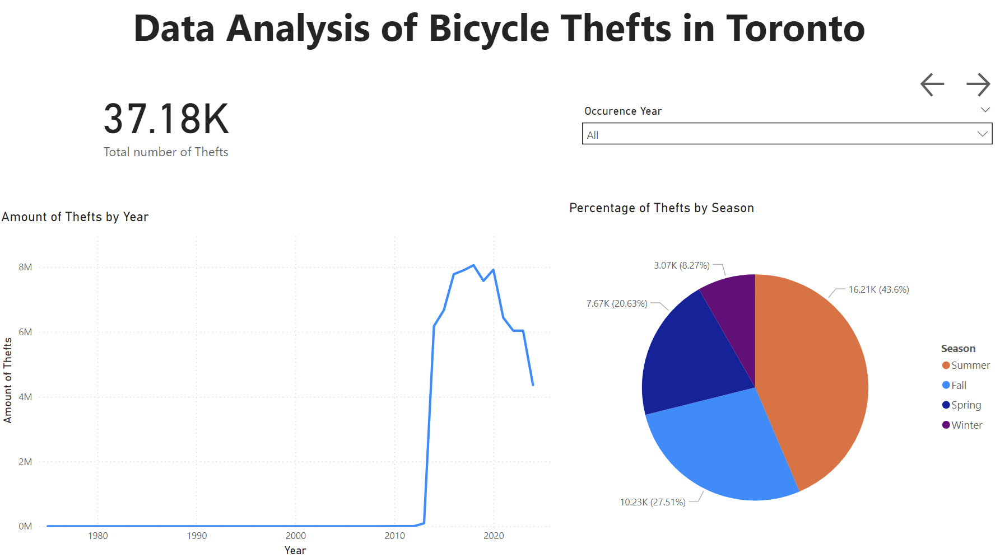
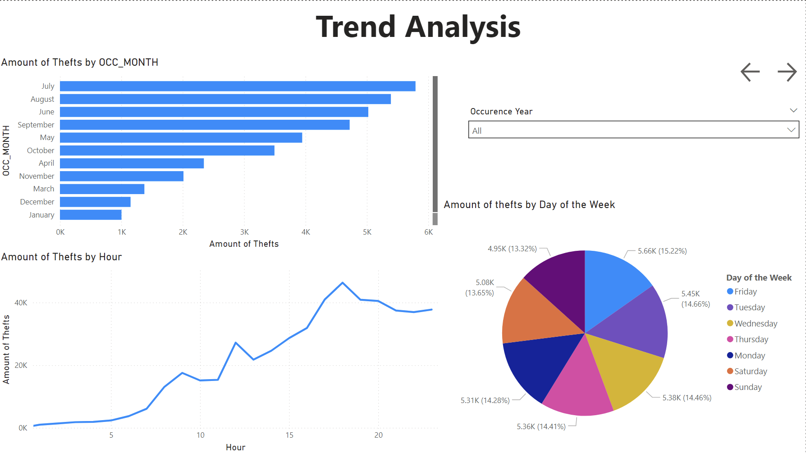
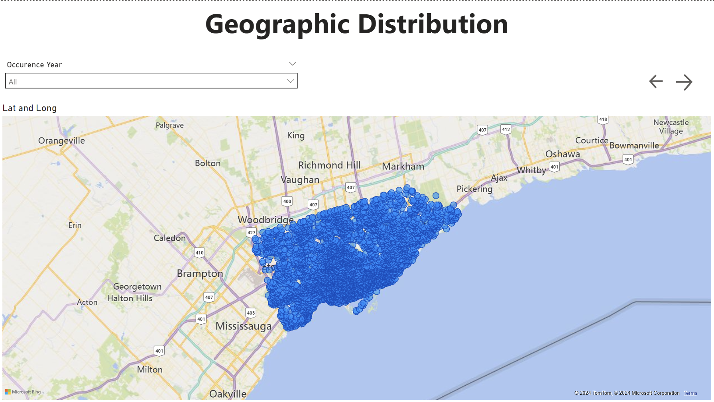

# Bicycle Theft Data Analysis and Machine Learning Project

This project focuses on analyzing bicycle theft data in Toronto to gain insights into theft patterns, identify trends, and build predictive models for actionable intelligence. The analysis employs exploratory data analysis (EDA), machine learning techniques, and data visualization using Python, Power BI, and Docker for deployment.

---

## Introduction

The **Bicycle Theft Data Analysis** project is an initiative to understand patterns and trends in bicycle theft incidents. Using statistical analysis, machine learning models, and visualizations, the project extracts meaningful insights to aid law enforcement and the community.

---

## Dataset

- **Name**: `Bicycle_Thefts.csv`
- **Description**: A dataset containing detailed records of bicycle theft incidents in Toronto.
- **Key Columns**:
  - `OCC_YEAR`: Year of the incident
  - `OCC_MONTH`: Month of the incident
  - `OCC_DAY`: Day of the incident
  - `OCC_HOUR`: Hour of the incident
  - `NEIGHBOURHOOD_158`: Neighbourhood identifier
  - `BIKE_COST`: Cost of the stolen bicycle
  - `BIKE_SPEED`: Speed (if applicable)

---

## Data Exploration and Cleaning

1. **Initial Exploration**:

   - Summary statistics and feature distributions.
   - Unique values for categorical variables.
   - Detection of outliers in numerical data.

2. **Data Cleaning**:

   - Missing values handled using median, mode, or placeholders (`"unknown"`).
   - Dropped unnecessary columns (`OBJECTID`, `EVENT_UNIQUE_ID`).
   - Encoded categorical variables using one-hot encoding and label encoding.
   - Normalized numerical data for better model performance.

3. **Preprocessing**:
   - Balanced the dataset using **SMOTE** (Synthetic Minority Oversampling Technique) to handle class imbalance.
   - Features standardized using `StandardScaler`.

---

## Power BI Dashboard

A comprehensive Power BI dashboard provides visual insights into theft patterns:

### **Overview Page**:

An interactive summary of key metrics, such as total thefts, year-over-year trends, and high-theft neighborhoods.

### **Trend Analysis Page**:

Visualization of theft trends by time (hour, day, month, and year).

### **Map Page**:

Geographical representation of theft hotspots across Toronto.

---

## Machine Learning Models

Several machine learning models were trained to predict the likelihood of bicycle theft recovery (`STATUS`).

### 1. Logistic Regression

- **Accuracy**: 96,3%
- **Key Features**:
  - Weighted for class imbalance.
  - ROC Curve and AUC calculated for each class.
- Visualizations:
  - Confusion Matrix
  - ROC Curve

### 2. Decision Tree Classifier

- **Accuracy**: 96,8%
- **Key Features**:
  - Weighted for class imbalance.
  - Visualized feature importance.
- Visualizations:
  - Confusion Matrix
  - ROC Curve

### 3. Random Forest Classifier

- **Accuracy**: 97,9%
- **Key Features**:
  - Ensemble learning approach.
  - Hyperparameters tuned (e.g., `n_estimators=100`, `max_depth=20`).
- Visualizations:
  - Confusion Matrix
  - ROC Curve

### Model Comparison:

- Logistic Regression: Suitable for interpretable predictions.
- Decision Tree: Clear decision rules but prone to overfitting.
- Random Forest: Best performance with robust generalization.

---

## Project Results

### Statistical Insights

- Higher theft incidents occur during late hours and in specific neighborhoods.
- More expensive bicycles are less likely to be recovered.

### Model Results

- Random Forest provided the highest accuracy (**97,9%**) and robust ROC-AUC scores.

### Visual Insights

- Time-based and location-based theft patterns identified using Power BI.
- Clear mapping of theft hotspots.

---

## Technology Stack

### Programming

- **Python**

### Libraries

- **Data Analysis**: Pandas, NumPy
- **Visualization**: Matplotlib, Power BI
- **Machine Learning**: scikit-learn, imbalanced-learn

### Deployment

- **Docker**
